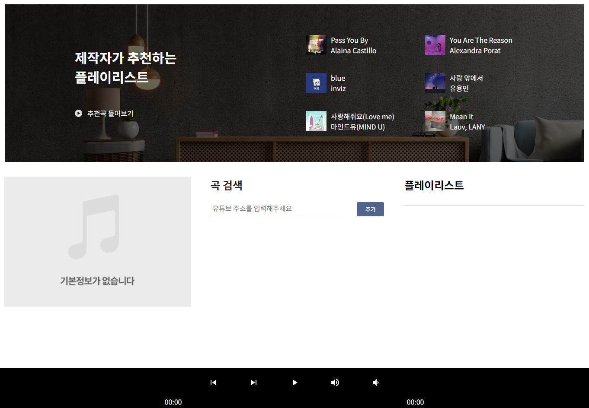

# 유튜브 API 플레이어

## ✏️ working category

개인 사이드 프로젝트
 

## 📃 using lang

TypeScript,React,ReactPlayer,ContextAPI,SCSS
 
 

## 프로젝트 아이디어

유튜브에 들어가는 번거러움 없이 유튜브 주소만으로 해당 주소의 내용을 스트레밍 할 순 없을까에서 발단
 
 

## Preview

  

### 📌 주요기능

- 유튜브에 있는 음악(주소)을(를) form에 입력하면 플레이어가 스트레밍
- 재생중인 곡의 정보를 띄워줌
- 플레이리스트에 즐겨찾기 기능
- 플레이리스트 조작 기능
- 오디오 컨트롤러

### ✔ 기능을 만들면서 생각해야하는 부분

- [x] 이번 사이드 프로젝트는 외부 라이브러리에 의존 하는 만큼 공식문서를 최대한 분석
- [x] 유튜브 api를 통해 주소의 전체 데이터를 가져오면 필요한 부분들만 필터해서 각 배열에 넣기
- [x] 현재 입력된 플레이리스트를 유지 한 채로 곡의 순서만 바꿔야함
- [x] react-player라고 해도 iframe 유튜브창을 띄워놓는 건데 이걸 임의의 컴포넌트로 만들어진 오디오 컨트롤러와 연결하는법
  > 현재 플레이타임 / 총 플레이타임 / 재생&일시정지 / 볼륨조절 / 곡 넘어가기 / 곡 중 원하는 플레이 타임으로 넘어가기
- [x] 플레이리스트 중 지금 재생곡의 index 찾아서 사용자에게 현재 어떤 순번이 재생되는지 노출시켜주기

### 🚀 기능 구현

- 체크사항 기능 구현 1 : 일과 완료된 갯수 / 총 할일의 배열길이 \* 100
- 체크사항 기능 구현 2 : 쿠키를 사용하여 오늘 자정이 되면 localstorage를 지우게 함
- 체크사항 기능 구현 3 : calendar.tsx 주석 참조
