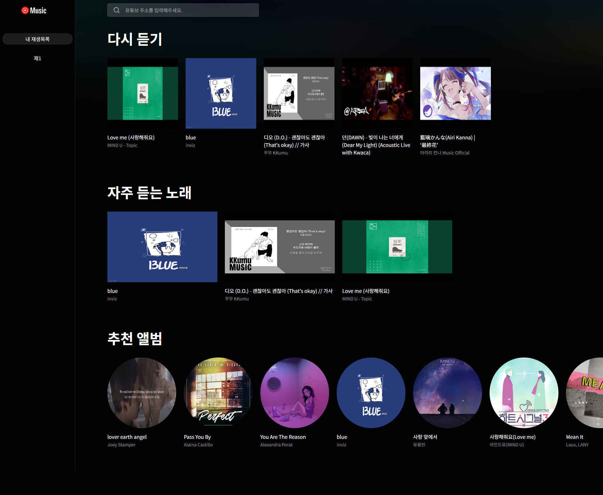
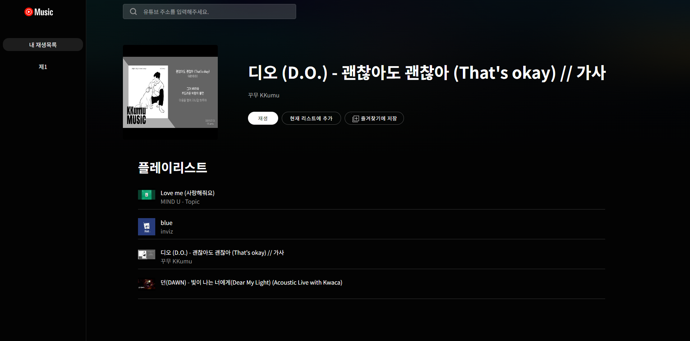
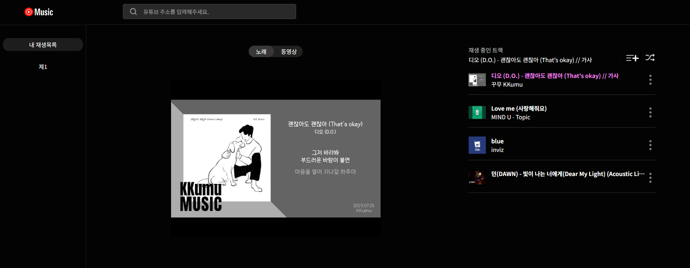

# 유튜브 뮤직 클론코딩

## ✏️ working category

개인 사이드 프로젝트
 

## 📃 using lang

TypeScript,React,ReactPlayer,ContextAPI,SCSS
 
 

## 프로젝트 아이디어

1. 유튜브에 들어가는 번거러움 없이 유튜브 주소만으로 해당 주소의 내용을 스트레밍 할 순 없을까에서 발단
2. API를 가져와서 API를 얼마나 활용 할 수 있는지 사이드 프로젝트를 하면서 시도
    
    

## Preview

  
  
  

### 📌 주요기능

- 폼에 유튜브 주소 검색시 검색 결과 페이지 노출
- 들은 앨범 다시듣기,앨범 즐겨찾기,빠른선곡,추천앨범 기능
- 플레이&일시정지 / 볼륨조절
- 플레이리스트 / 내 플레이리스트 저장 / 곡 셔플 기능
- 한곡만 반복&전체반복 / 이전 곡&다음곡으로 이동

### ✔ 기능을 만들면서 생각해야하는 부분

- [x] 유튜브 주소를 입력하면 주소에 관련된 데이터를 가져오는 코드 짜기
- [x] 가져온 데이터 코드로 실행 / 저장 / 활용
- [x] 플레이 순서를 바꿀 때, 현재 입력된 플레이리스트를 유지 한 채 플레이리스트 컨트롤
- [x] 트랙 배열이 있는데 트랙의 index 조절로 반복/ 곡이동을 컨트롤
- [x] react-player라고 해도 iframe 유튜브창을 띄워놓는 건데 이걸 임의의 컴포넌트로 만들어진 오디오 컨트롤러와 연결하는법
  > 현재 플레이타임 & 총 플레이타임 / 재생&일시정지 /플레이정보 / 볼륨조절 / 곡 넘어가기 / 곡 중 원하는 플레이 타임으로 넘어가기

### 🚀 기능 구현

#### 유튜브 api 불러오기

1. form에 입력된 주소 중 "youtube"와 "watch"가 포함 되어 있는 지 체크 후 watch 뒤 동영상 ID 추출
2. 그렇게 추출 된 동영상 ID를 URLSearchParams를 이용하여 json 형식으로 해당 주소의 데이터를 가져옴
3. 가져온 데이터 중 필요한 데이터를 객체로 생성하여 state안에 넣고 스트레밍 & 플레이 리스트 만들어줌

#### 곡 저장 로직

다시듣기,앨범 즐겨찾기,빠른선곡 모두 재생 또는 클릭시 localstorage에 데이터를 저장하여 랜더링시 데이터를 불러옴

#### 곡 셔플 & 원하는 곡 바로 재생

- shuffleHandler 함수

곡셔플에 사용될 체크박스에 체크 할시 배열에 순차적으로 저장 (배열엔 index가 담김)

저장된 배열에서 forEach문으로 돌려 index부터 index +1 까지 splice 한 객체를 newList 배열에 저장

플레이리스트와 트랙 배열에서 newList 배열에 있는 요소들을 제거 하고
const result = [...newList,...원본배열] 로 배열을 조작

- directPlay 함수
클릭한 index를 splice로 추출한 후 다시 배열에 넣으면 됨

#### 플레이어 컨트롤

 
- start / play / error 등의 이벤트가 일어 났을 시 콜백함수를 생성하여 실행 (player.tsx 41줄 ~ 94줄 까지 참조)

#### 트랙배열 index 컨트롤

 
track[playIndex]에 들어가는 playIndex의 state를 컨트롤

#### 오디오 컨트롤러

- 재생/일시정지 / 다음 곡 넘어가기 / 볼륨조절 audio.tsx 참조
