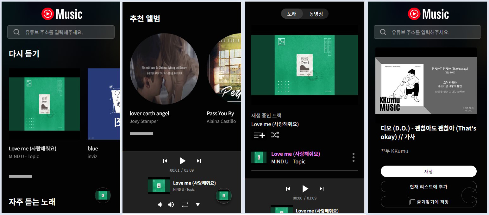

# 유튜브 뮤직 클론코딩

## ✏️ working category

개인 사이드 프로젝트
 
 
🖥️ using project : https://yotubemugic-clones.netlify.app
 

## 📃 using lang

TypeScript,React,ReactPlayer,ContextAPI,SCSS
 
 

## 프로젝트 아이디어

1. 유튜브에 들어가는 번거러움 없이 유튜브 주소만으로 해당 주소의 내용을 스트레밍 할 순 없을까에서 발단
2. API를 가져와서 API를 얼마나 활용 할 수 있는지 사이드 프로젝트를 하면서 시도
    
    

## Preview

  

### 📌 주요기능

- 폼에 유튜브 주소 검색시 검색 결과 페이지 노출
- 들은 앨범 다시듣기,앨범 즐겨찾기,빠른선곡,추천앨범 기능
- 플레이&일시정지 / 볼륨조절
- 플레이리스트 / 내 플레이리스트 저장 / 곡 셔플 기능
- 한곡만 반복&전체반복 / 이전 곡&다음곡으로 이동

### ✔ 기능을 만들면서 생각해야하는 부분

- [x] 유튜브 주소를 입력하면 주소에 관련된 데이터를 가져오는 코드 짜서 노출 시키기
- [x] 가져온 데이터 코드로 재생 / 저장 / 활용
- [x] 트랙 배열의 index 조절로 곡 반복 / 플레이순서 / 곡이동을 컨트롤
- [x] react-player라고 해도 iframe 유튜브창을 띄워놓는 건데 이걸 임의의 컴포넌트로 만들어진 오디오 컨트롤러와 연결하기
  > 현재 플레이타임 & 총 플레이타임 / 재생&일시정지 / 플레이 곡 정보 / 볼륨조절 / 곡 넘어가기 / 곡 중 원하는 플레이 타임으로 넘어가기

### 🚀 기능 구현

#### 유튜브 api 불러와서 노출 시키기

1. form에 입력된 주소 중 "youtube"와 "watch"가 포함 되어 있는 지 체크 후 watch 뒤 동영상 ID 추출
2. 그렇게 추출 된 동영상 ID를 URLSearchParams를 이용하여 json 형식으로 해당 주소의 데이터를 가져옴
3. 가져온 데이터 중 필요한 데이터를 객체로 생성하여 state안에 넣고 결과를 검색결과 페이지에 노출
4. 검색결과 페이지에 노출된 데이터로 재생/즐겨찾기 추가/플레이리스트를 구성할 수 있다.

#### 곡 저장 로직

다시듣기,앨범 즐겨찾기,빠른선곡 모두 재생 또는 클릭시 localstorage에 데이터를 저장하여 랜더링시 데이터를 불러옴

#### 곡 셔플 & 원하는 곡 바로 재생

- shuffleHandler 함수 (곡 셔플)
- directPlay 함수(바로재생)

저장된 배열에서 forEach문으로 돌려 index부터 index +1 까지 splice 한 객체를 newList 배열에 저장

#### 플레이어 컨트롤

 
- start / play / error 등의 이벤트가 일어 났을 시 콜백함수를 생성하여 실행 (player.tsx 41줄 ~ 94줄 까지 참조)

#### 트랙배열 index 컨트롤

 
- track[playIndex]에 들어가는 playIndex의 state를 컨트롤

### 🧑🏻‍💻 트러블 슈팅

#### 문제발견

플레이어는 track 배열의 순서대로 실행하고 있는데 곡 셔플이라던가 지금 재생을 실행 하게 되면 track의 구성이 바뀌면서 index 들도 바뀌게 된다.

#### 문제인식

그래서 track을 제어하게 되면 새 곡이 재생되거나, 현재 플레이곡이 끝났을때 현재 플레이중인 곡의 index + 1이 되야하는데, 
원래 track 순서의 index +1이 되서 플레이 순서가 이상해진다.

#### 문제 판단

track의 index를 state로 해놓으면 track의 구성이 바뀌어도 현재곡의 정보가 바뀌지 않는다

#### 해결법

일단 playIndex의 원리와 setPlayIndex가 언제 작동 하는 지 알 필요가 있다.&nbsp;(playIndex의 작동 원리는 곡이 끝날 때 playIndex + 1이 됨)

1. 때에 따라 현재 플레이되는 곡의 정보와 playIndex의 값이 다를 경우 다시 setIndex를 해준다
2. track의 구성이 다를 때 index을 0으로 바꾸거나 구성에 맞는 index로 바꿔준다.
3. 곡 셔플 기능을 사용 할 시 플레이리스트에서 index를 먼저 기억 시켜놓고 셔플 한 후 다시 기억된 index를 찾아서 setIndex 해줌
